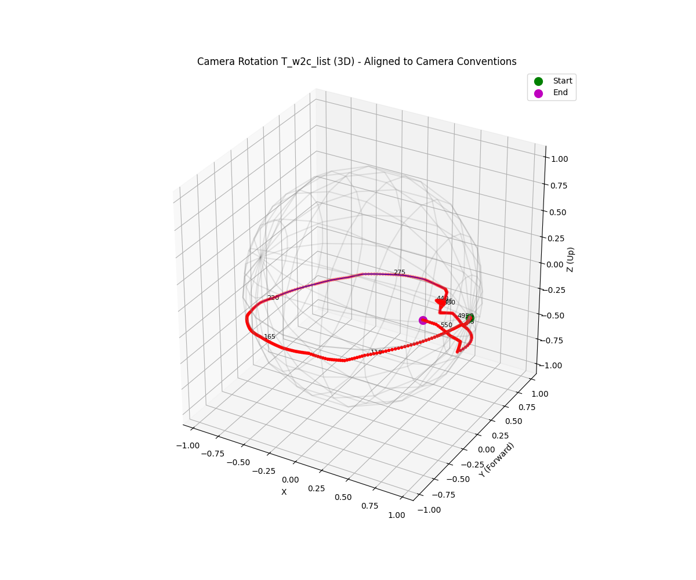
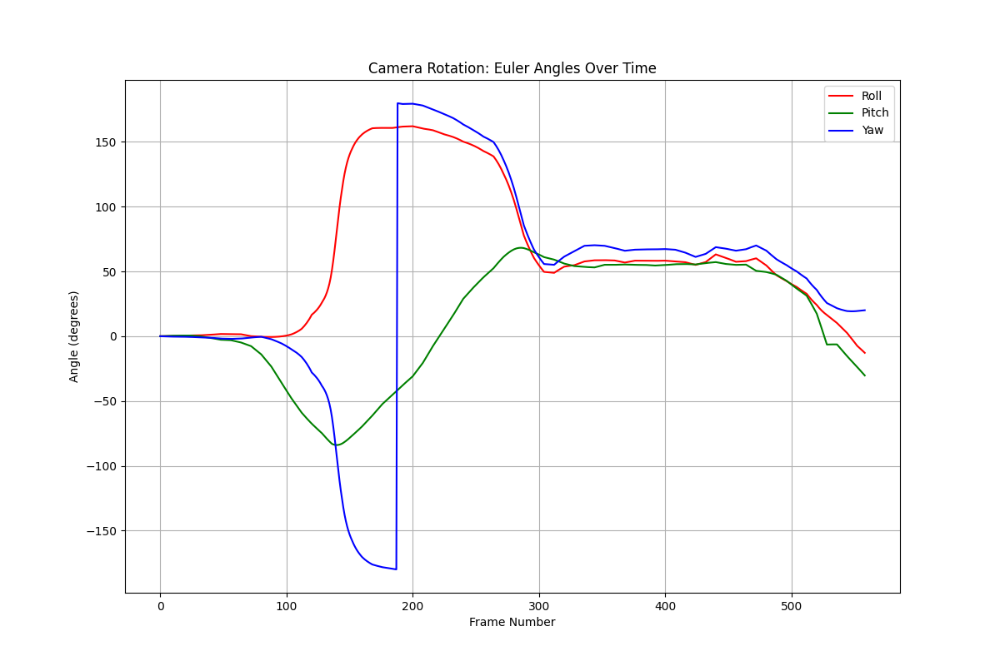
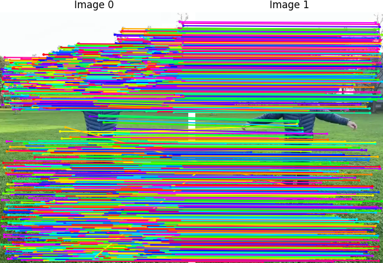

# Relative Pose

1. `run_pair.py`: Match image0 and image1, draw matches.
2. `run.py`: Compute camera poses of a given video. Camera poses are defined as T_i @ p_world = p_cam.

## Method
Given a video, pick images every N frames, do feature matching, and solve camera poses.

Matcher:
1. sift: opencv SIFT
2. orb: opencv ORB

Solver:
1. pycolmap: call `pycolmap.estimate_calibrated_two_view_geometry` (auto select from essential or homography matrix)
2. cv2: ransac to find the best essential matrix


## Installation

```bash
# Match and solve camera poses
pip install opencv-python pycolmap

# Read videos
pip install video-reader-rs  # read videos
apt install ffmpeg   # ffmpeg is required
```

## Example
- input video (from EMDB dataset):

https://github.com/user-attachments/assets/c6ee591c-4f57-4423-9a7c-cea60518997f


- output:

    | Camera Direction Trajectory | Rotation Angles | Matches |
    | ---------------------------------------------- | --------------- | ------- |
    |  |  |  |
